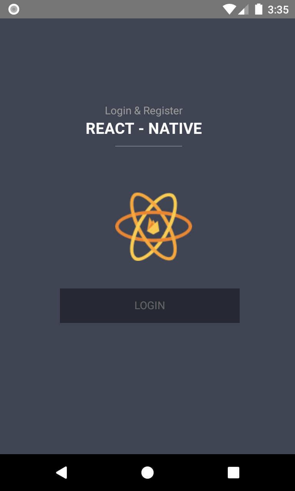
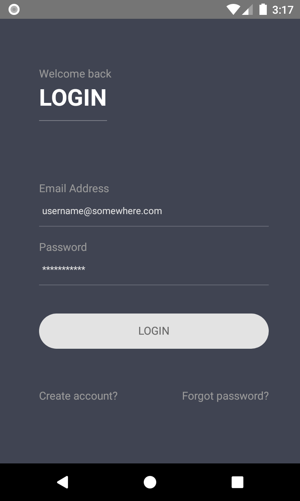
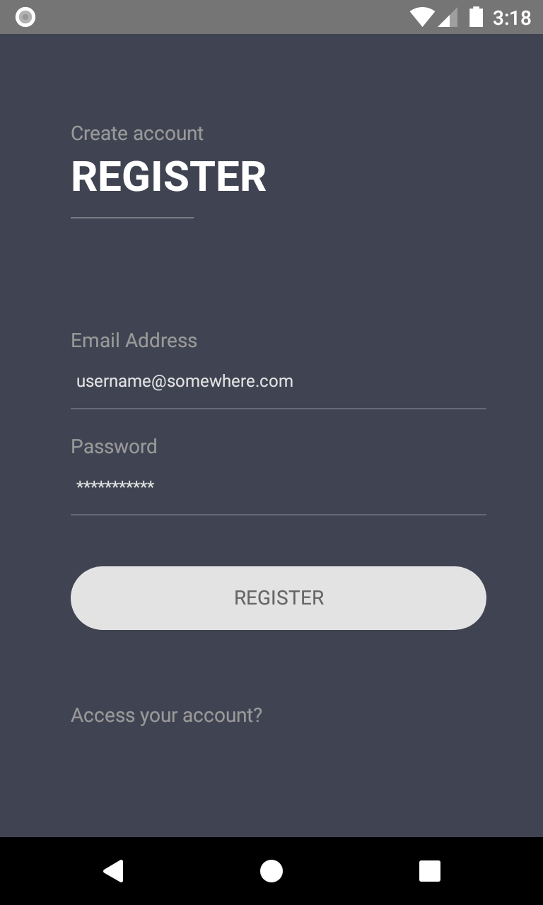

# React Native Login & Registration Starter
- As registration and login starter template for react native.

# Installation
- Git clone the project and run `npm i` to install all the required dependecies.
- `react-native start` to start the local developement server for the project and `react-native run-android / run-ios` to ru
the project on ios or android emulator ( make sure either of the emulator is running )

# Screenshots
<b>Welcome view</b> 
 
<b>Login view</b> 
 
<b>Registration view</b> 

